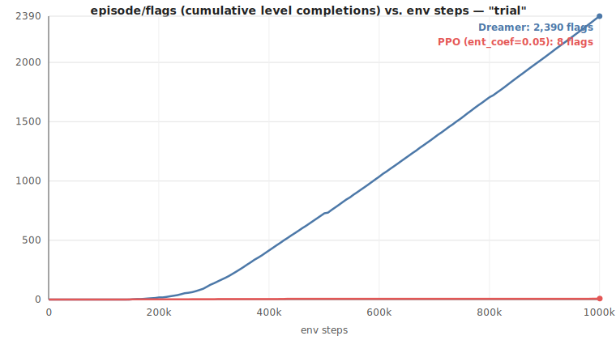

# Case study: Dreamer vs. PPO on `trial`

A worked example of the sample-efficiency comparison described in
[baselines.md](baselines.md#how-to-compare-after-both-have-run), using this project's own `trial`
run — both trained to the same `1,000,000`-env-step budget, same env wrapper (`SuperMarioBros-1-1`,
`frame_skip=4`, dense reward, `right_only` action set), so the step axis is directly comparable
between them.

## Result



| | Dreamer | PPO (`ent_coef=0.05`) |
|---|---|---|
| First flag captured | step 153,000 | step 142,336 |
| First reached `best_x=3161` (the flag) | step 153,000 | step 142,336 |
| **Total flag captures over 1,000,000 steps** | **2,390** | **8** |

**Both algorithms found the flag at roughly the same point** — PPO actually got there a little
sooner (142k vs. 153k steps). If you stopped either run right there, you'd conclude they were
comparably capable. The real difference shows up after the breakthrough: Dreamer's rate of level
completions kept accelerating for the rest of training, while PPO's plateaued hard. Its own
`episode/flags` value-changes tell the story directly:

```
step 142,336 → 1 flag
step 151,040 → 2
step 258,048 → 3
step 301,056 → 4
step 417,280 → 5
step 429,056 → 6
step 983,040 → 7   (554,000 steps with zero improvement before this)
step 994,304 → 8
```

**Conclusion**: at equal environment-step budgets, the two algorithms are comparably fast at
*finding* the goal once, but only Dreamer converts that into *reliably repeating* it. That's the
actual question this baseline exists to answer — sample efficiency in becoming good at the task,
not who reaches it first — and the ~300x gap in total completions is large enough that ordinary
run-to-run variance is very unlikely to explain it (see the caveat below on variance regardless).

## Two things that had to be fixed to get this result

**PPO policy collapse.** The first two attempts at this comparison (`ppo.ent_coef=0.02`, the
project's former default) both collapsed into a single repeated dead-end trajectory —
`episode/best_x`, `episode/flags`, `rollout/ep_rew_mean`, and `rollout/ep_len_mean` all went
perfectly flat simultaneously for hundreds of thousands of steps, the signature of a fully
deterministic policy with no exploration left. `ppo.ent_coef=0.05` (now the config default) was
the first value that avoided it. Full writeup:
[baselines.md](baselines.md#a-real-failure-mode-ppo-policy-collapse-and-why-ent_coef-matters).

**Dreamer's `episode/flags` resetting on resume.** This `trial` run was trained in two phases
(interrupted and resumed partway through by re-running `train.py --name trial`). `episode/flags`
is a local, non-checkpointed counter — see [training.md](training.md#is-it-safe-to-change-this-on-resume)
— so it silently reset to `0` at the resume point instead of continuing the true lifetime count.
The `2,390` figure above is manually corrected for this (the pre-resume peak plus the post-resume
final value); TensorBoard's own raw display would have under-reported it as `1,663`. This is a
real bug, tracked for a proper fix so future comparisons don't need the manual correction.

## Caveats

- **Single seed on the PPO side.** We directly watched PPO be seed/hyperparameter-sensitive here
  (two collapses before a working run) — the headline gap is large enough that it's unlikely to be
  pure variance, but if you want to present this more rigorously, running PPO two or three more
  times at `ent_coef=0.05` and checking the spread would substantiate that this run wasn't a fluke
  in the other direction (unusually good luck).
- **One fixed budget.** Both were compared at exactly `1,000,000` steps. Whether PPO's late uptick
  (flags 6→7→8 right at the end) would continue with a larger budget, or whether it had already
  found its ceiling, isn't tested here.
- **`episode/return` isn't compared** — see [baselines.md](baselines.md#how-to-compare-after-both-have-run)
  for why Dreamer's return and SB3's `rollout/ep_rew_mean` aren't apples-to-apples.

## Reproducing this

```bash
python scripts/train.py --name trial --set train.total_steps=1000000
python baselines/ppo_baseline.py --name trial   # ent_coef=0.05 is now the default
python scripts/dashboard.py --name trial --ppo-name trial
```

Watch for the collapse symptom above if you change `ent_coef` back down — `episode/flags` sitting
at exactly `0` for a while early on is normal (Dreamer's own curve does this too, see
[monitoring.md](monitoring.md)); several metrics all going perfectly flat *simultaneously* for a
long stretch is not.
